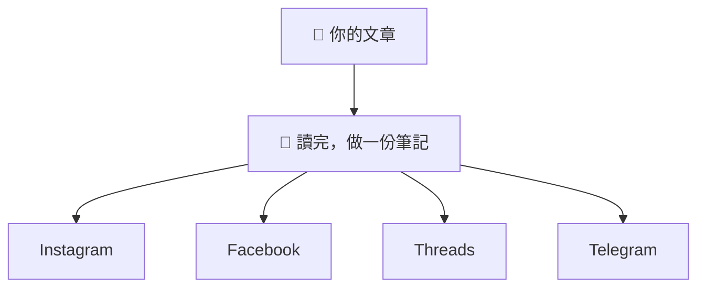
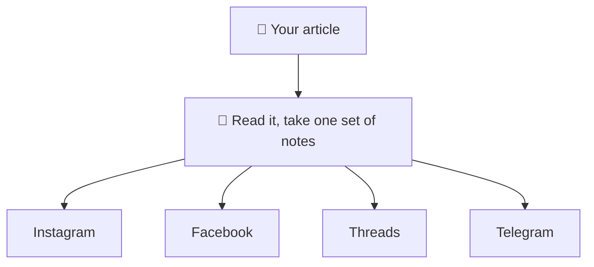

# lets-social

**你寫好一篇文章。它幫你寫好四則社群貼文。**

[正體中文](#正體中文) | [English](#english)

## 正體中文

### 一句話

文章丟進去，Instagram、Facebook、Threads、Telegram 的貼文寫出來；Instagram 另附可直接產圖的 prompt。

### 想像一下

你請四個朋友幫你宣傳同一篇文章。

| 朋友 | 他會怎麼寫 |
| --- | --- |
| **Instagram** | 手機滑很快，先講重點，再準備配圖 |
| **Facebook** | 想聊聊你為什麼寫這篇 |
| **Threads** | 講一句觀察，等別人接話 |
| **Telegram** | 列成幾點，掃一眼就懂 |

重點是：**四個人各自讀完你的文章再動筆**。

不是一個人寫完，另外三個拿去改長度。



### 它不會做的三件事

**1. 不編造**

你文章沒寫的數字、沒說的結論、沒做過的實驗，它不會幫你補。

**2. 不發文，也不自動產圖**

它提供貼文與產圖 prompt。要不要產圖、發文或排程，都由你決定。

**3. 讀不到就說讀不到**

給它網址但打不開，它會停下來跟你要文章內容。不會假裝讀過。

### 安裝

一行指令，貼上就好。

```bash
git clone https://github.com/letswritetw/lets-social.git ~/.claude/skills/lets-social
```

用 Codex 的話換這行：

```bash
git clone https://github.com/letswritetw/lets-social.git ~/.agents/skills/lets-social
```

<details>
<summary>Windows 使用者請點這裡</summary>

Git Bash 可以直接用上面的指令。PowerShell 和 cmd 不會展開 `~`，會在當前目錄建一個名字叫 `~` 的資料夾，請改用下面的指令。

PowerShell，Claude Code：

```powershell
git clone https://github.com/letswritetw/lets-social.git "$HOME/.claude/skills/lets-social"
```

PowerShell，Codex：

```powershell
git clone https://github.com/letswritetw/lets-social.git "$HOME/.agents/skills/lets-social"
```

cmd，Claude Code：

```text
git clone https://github.com/letswritetw/lets-social.git "%USERPROFILE%/.claude/skills/lets-social"
```

cmd，Codex：

```text
git clone https://github.com/letswritetw/lets-social.git "%USERPROFILE%/.agents/skills/lets-social"
```

</details>

Skill 本身不用套件或 API key。若要使用產圖 prompt，請自行開啟 Gemini 或 ChatGPT；能否使用產圖功能依你的帳號方案而定。

### 開始用

```text
/lets-social 把 ./article.md 轉成社群貼文
```

結束。

Instagram 會在文案後提供兩份完整 prompt：

- Nano Banana 2
- ChatGPT Images 2.0

兩份 prompt 描述同一個視覺，可以直接複製到對應工具。Threads 只有在圖片能補充比較、流程或具體物件時才提供；純觀點貼文不會硬塞配圖。

視覺風格會依文章內容挑選，不是每篇都套同一套：清單型文章走知識圖卡、架構或流程走編輯式圖解、單一主張走大字海報、底層工程走終端機或藍圖風、團隊與流程走插畫場景。不論哪種風格，都會用至少四個顏色、把文章重點寫在圖上，中文一律指定清楚的粗體無襯線字（手寫中文一定糊）。想指定風格，直接在指令裡說明就會照做。ChatGPT Images 2.0 一次最多可產 10 張，且每張可以講不同內容，所以它那份 prompt 預設是一組編號系列：封面一張，之後每個重點各一張。只要一張的話，說一聲就好。

### 想再指定一點

想少做幾個平台：

```text
只產生 Threads 與 Telegram。
```

想換語氣：

```text
不要 emoji，不要 hashtag，講白話一點。
```

想控制圖片：

```text
Instagram 不要產圖 prompt；Threads 這篇要一張配圖。
```

寫完覺得某一個不對：

```text
Threads 再短一點。
```

它只會改 Threads，其他三個不動。

### 想先看看成品

- [丟進去的文章長這樣](examples/input-example.md)
- [跑出來的四則貼文長這樣](examples/output-example.md)

### 還想知道更多

這份是快速版。想看完整規則、各平台細節、怎麼加新平台，請看 [完整版 README](README-full.md)。

授權 [MIT](LICENSE)，來自 [Let's Write](https://www.letswrite.tw/)。

---

## English

### In one line

Drop in an article. Get posts for Instagram, Facebook, Threads, and Telegram, plus copy-ready Instagram image prompts.

### Picture this

You ask four friends to help promote the same article.

| Friend | How they write |
| --- | --- |
| **Instagram** | People scroll fast, so lead with the point and prepare a visual |
| **Facebook** | Wants to talk about why you wrote it |
| **Threads** | Drops one observation and waits for replies |
| **Telegram** | Lists a few points you can scan in seconds |

Here is what matters: **each friend reads your article first, then writes**.

One of them does not write it and hand it to the other three to resize.



### Three things it will not do

**1. It will not make things up**

Numbers you never wrote, conclusions you never drew, tests you never ran. It leaves them out.

**2. It will not publish or generate images for you**

You get post drafts and image prompts. You decide whether to generate an image, publish, or schedule anything.

**3. It will say when it cannot read something**

Give it a URL it cannot open and it stops and asks you for the text. It will not pretend it read the page.

### Install

One line. Paste it.

```bash
git clone https://github.com/letswritetw/lets-social.git ~/.claude/skills/lets-social
```

For Codex, use this one instead:

```bash
git clone https://github.com/letswritetw/lets-social.git ~/.agents/skills/lets-social
```

<details>
<summary>On Windows, read this</summary>

Git Bash runs the commands above as they are. PowerShell and cmd do not expand `~`, so they create a folder literally named `~` in the current directory. Use these instead.

PowerShell, Claude Code:

```powershell
git clone https://github.com/letswritetw/lets-social.git "$HOME/.claude/skills/lets-social"
```

PowerShell, Codex:

```powershell
git clone https://github.com/letswritetw/lets-social.git "$HOME/.agents/skills/lets-social"
```

cmd, Claude Code:

```text
git clone https://github.com/letswritetw/lets-social.git "%USERPROFILE%/.claude/skills/lets-social"
```

cmd, Codex:

```text
git clone https://github.com/letswritetw/lets-social.git "%USERPROFILE%/.agents/skills/lets-social"
```

</details>

The skill needs no package or API key. To use its image prompts, open Gemini or ChatGPT yourself; image access depends on your account plan.

### Use it

```text
/lets-social Turn ./article.md into social posts
```

That is it.

Instagram adds two complete prompts after the copy:

- Nano Banana 2
- ChatGPT Images 2.0

Both prompts describe the same visual and are ready to paste into the matching tool. Threads adds them only when an image clarifies a comparison, process, or physical subject. It leaves text-first observations alone.

The visual style is chosen per article rather than fixed: a knowledge card for checklists, an editorial diagram for architecture or flow, a typographic poster for a single claim, a terminal or blueprint look for low-level engineering, an illustrated scene for team and process pieces. Whatever the style, the prompt names at least four colors, writes the article's key points on the image, and pins CJK to clean bold sans-serif, since handwritten CJK renders as mush. Name a style yourself and it will follow. ChatGPT Images 2.0 renders up to ten images per prompt and each one can carry different content, so its prompt asks for a numbered series: a cover, then one image per key point. Ask for a single image and it will drop the rest.

### Want more control

Fewer platforms:

```text
Only Threads and Telegram.
```

Different voice:

```text
No emoji, no hashtags, keep it plain.
```

Image control:

```text
Skip image prompts for Instagram. Add one image concept for Threads.
```

One draft came out wrong:

```text
Make Threads shorter.
```

It changes Threads only. The other three stay put.

### See it work first

- [What goes in](examples/input-example.md)
- [What comes out, all four platforms](examples/output-example.md)

### Want the details

This is the short version. For the full rules, per-platform behavior, and how to add a platform, see the [full README](README-full.md).

[MIT](LICENSE) licensed, from [Let's Write](https://www.letswrite.tw/).
